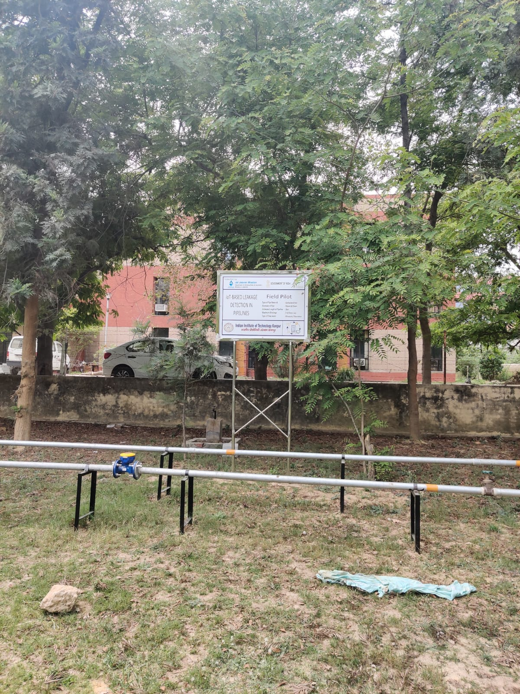

# Jal Jeevan Mission: Water Leakage Detection

A field pilot at IIT Kanpur, under the Jal Jeevan Mission (JJM), to build a cheap and scalable leak-detection system for rural water supply. This repository holds the Phase 1 and Phase 2 material (Dec 2022 to about spring 2024): the literature review, the testbed design, the experiment dataset, and a first machine-learning study.

## Project at a glance

| Phase | Period | Focus |
| --- | --- | --- |
| 1 | Dec 2022 to Apr 2023 | Literature review of leak-sensing methods, closed-loop pipe testbed design, first cloud pipeline for three ultrasonic flow meters |
| 2 | Aug 2023 to Mar 2024 | Staged leak experiments (1, 2 and 3 leaks at low, moderate and high severity), a 22-experiment dataset, first ML models |

## Key finding

With the flow-meter data collected, leak state **cannot be predicted better than a trivial baseline**. The meters report in 0.01 m³/min (10 L/min) steps, while each emulated leak was only about 2 to 6 L/min, so the leak signal sits mostly below one reading step. Models score within about 11 points of always guessing the majority class, and score below chance when whole experiments are held out. This pointed the project toward accelerometer-based sensing. 

## Testbed

A closed loop of galvanized-iron pipe on raised supports, with a 500 L tank and a 1 HP pump. Leaks are emulated with small drilled holes fitted with nozzles. Three ultrasonic flow meters (FM-2891, FM-3232, FM-3327) report to a cloud dashboard, with data logged to AWS.



## Repository structure

```
.
├── docs/
│   ├── UGP_Report_final.pdf                                           # Phase 1 undergraduate project report (Apr 2023)
│   └── Summary.docx                                                   # written summary of the Jan 2024 experiments
├── data/
│   ├── JJM_Dataset.csv                                                # labelled 22-experiment dataset (Jan 2024)
│   └── raw/
│       ├── Raw Data Mar 2023 ... 
├── notebooks/
│   └── ml.ipynb                                                       # Decision Tree / Random Forest / Logistic Regression study
└── images/
    └── testbed.jpeg                                                   # field pilot photo (18 Apr 2023)
```

## Dataset

`data/JJM_Dataset.csv` has 676 labelled rows: one reading per minute across 22 experiments of 29 to 39 minutes each, collected on 8 to 10 Jan 2024.

- **Features:** readings from the three flow meters, in m³/min.
- **Labels:** the state of leak points L1, L3 and L4, each `OFF`, `L`, `M` or `H`.
- **Experiment design:** one no-leak baseline, then each leak point alone, in pairs, and all three together, each at low, moderate and high severity.
- **Caveats:** rows are in reverse-chronological order with 12-hour time strings, so sort and parse before any time-series work. The meters take only about six distinct values each, and FM-2891 carries almost no information (it reads 0.01 or 0.02 throughout).

## Modelling notebook

`notebooks/ml.ipynb` (scikit-learn) collapses L/M/H into a single ON class, min-max scales the three meter readings, and trains one binary classifier per leak point.

Accuracy (%) on an 80/20 random split, against the majority-class baseline:

| Model | L1 | L3 | L4 |
| --- | --- | --- | --- |
| Decision Tree | 63.97 | 57.36 | 54.41 |
| Random Forest | 65.44 | 57.36 | 54.41 |
| Logistic Regression | 57.35 | 52.21 | 58.08 |
| Majority-class baseline | 54.1 | 54.3 | 53.6 |

These numbers should not be read as real performance. The repetitive data makes random splits leak information between train and test. The notebook also contains an experiment-wise split (commented out), and on that split the models do worse than chance. 

## Running the notebook

```bash
pip install pandas numpy scikit-learn matplotlib jupyter
jupyter notebook notebooks/ml.ipynb
```

Update the CSV path in the notebook to `../data/JJM_Dataset.csv` if it still points at the original `pt2/` folder.

## Authors

Phase 1 UGP report: Aniket Suhas Borkar and Tejas Ramakrishnan, under the supervision of the IIT Kanpur project faculty. 
